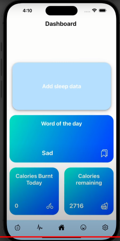

# AmigosHealthApp

## HealthHub
 A health-centric application, allowing for the measurement of fitness, diet and mental health.

### Demo Video

A 7 minute video demonstrating the majority of HealthHub's features:

https://www.youtube.com/watch?v=bfum42dR34A&ab_channel=HealthHub 

## Setup

To setup the server ensure that NPM is installed on your system using the latest LTS build this can be achieved using nvm.
Go into both the client and the server folders and run npm i whilst inside each to ensure all the dependencies are downloaded for both.

Server setup

*Note: Replication of project at this point may be difficult as the supabase has been taken down.*

Create a .env file in the root of the server in which you provide the data 

Then you can run npm run dev to start the server locally on the port 3001 ensure that no other local servers are running on this server (NOTE you may need to run the command twice on initial setup to ensure that you have the message) or whatever port you are using.

#### Testing the server
If on Linux, use the command npm run testOnLinux , likewise on Windows npm run testOnWindows. Else, remove the dist folder manually, if present, then run the command npm run test from the terminal inside the Server folder

Client set up

Ensure that you setup an env file to contain the following information

Replace YourIPAddress, with your local ipv4 address which can be found here

#### REMOTE SETUP
*No longer available as server is down*

URL='https://healthhubunitedkingdom.azurewebsites.net'

USING_DEPLOYED_SERVER="true"

#### LOCAL SERVER SETUP
PORT=3001

IP_ADDRESS=192.168.0.12

URL=""

USING_DEPLOYED_SERVER=""

Replace IP_ADDRESS with your local ip address using info found above.
When inside the Client folder run npm run start for a normal start or npm run freshStart to restart and rebuild all the files.

#### Emulators
Follow this guide for android emulator setup and this guide for ios emulator setup if you have an Apple device so that you can run a local emulator 
OR
You can run the app on your own phone iphone or android, by simply installing the Expo Go application from the store and then scanning the barcode(android supports it from the app, for iphone do it on the camera).

Now you can use the app to be able to access the functionality of the Client you will require to either connect to the deployed server or the local server that you have and pass in your local IP address. NOTE if you change the .env be sure to do a freshStart

#### Testing the client

Prerequisites for client testing: 
-Run server using npm run dev inside the server folder, 
-Run web version of app via npm run start and then w to run web version

To test the client you can run npm run cypressTests inside the terminal in the Client folder.
Another way to test is by running npx cypress open in the Client terminal, this will open a cypress window. Select the configured end to end testing, select the browser you wish to run the tests and select the file you want to run tests on.

## Authors

Manik Aggarwal

Alexander (Sasha) Grebenyuk

Ethan Hutchins

Vishal Kumar

Saathveekan (Saath) Satheeshkumar

Mohamed (Shazeen) Shaheen Nazeer

Ashley (Ashley) Tyagi
